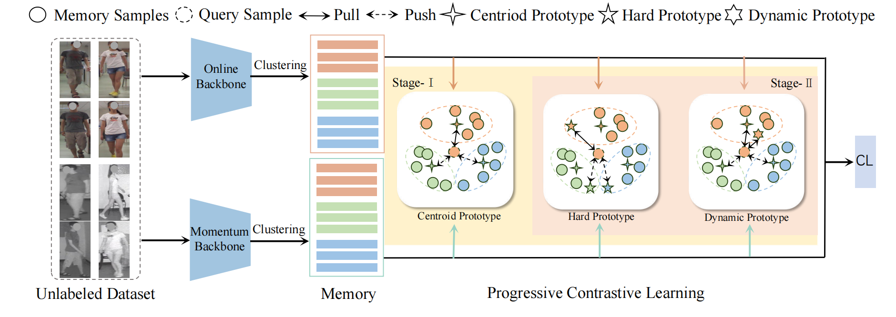

<p align="center">
  <h1 align="center">Learning Commonality, Divergence and Variety for Unsupervised Visible-Infrared Person Re-identification</h1>
</p>

<p align="center">
  <a href="https://img.shields.io/badge/Conference-NeurIPS%202024-4b8bbe?style=for-the-badge" target="_blank"></a>
  <a href="https://img.shields.io/badge/Framework-PyTorch-ee4c2c?style=for-the-badge&logo=pytorch" target="_blank"></a>
  <a href="https://img.shields.io/badge/Python-3.8.13-3776AB?style=for-the-badge&logo=python" target="_blank"></a>
</p>

<p align="center">
  <a href="https://scholar.google.com/citations?user=Go9q2jsAAAAJ&hl=zh-CN&oi=sra" target="_blank"><strong>Jiangming Shi*</strong></a><sup>1,2</sup> ·
  <a href="https://scholar.google.com/citations?hl=zh-CN&pli=1&user=H1rqfM4AAAAJ" target="_blank"><strong>Xiangbo Yin*</strong></a><sup>2</sup> ·
  <a href="https://scholar.google.com/citations?user=a-I8c8EAAAAJ&hl=zh-CN&oi=sra" target="_blank"><strong>Yachao Zhang</strong></a><sup>3</sup> ·
  <a href="https://scholar.google.com/citations?user=CXZciFAAAAAJ&hl=zh-CN&oi=sra" target="_blank"><strong>Zhizhong Zhang</strong></a><sup>3</sup> ·
  <a href="https://scholar.google.com/citations?user=RN1QMPgAAAAJ&hl=zh-CN&oi=sra" target="_blank"><strong>Yuan Xie†</strong></a><sup>2</sup> ·
  <a href="https://scholar.google.com/citations?user=idiP90sAAAAJ&hl=zh-CN&oi=sra" target="_blank"><strong>Yanyun Qu†</strong></a><sup>2</sup>
</p>

<p align="center">
  <sup>1</sup>Shanghai Chuangzhi College, Shanghai, China <br>
  <sup>2</sup>Xiamen University, Xiamen, China <br>
  <sup>3</sup>East China Normal University, Shanghai, China
</p>

<p align="center">
  <a href="https://arxiv.org/pdf/2402.19026" target="_blank">📄 <strong>Paper Link (arXiv:2402.19026)</strong></a><br>
  <em>Accepted at NeurIPS 2024</em>
</p>

<p align="center">
  
</p>

---

## 🚀 Introduction
This repository provides the **official PyTorch implementation** of  
**“Learning Commonality, Divergence and Variety for Unsupervised Visible-Infrared Person Re-identification”**,  
accepted at **NeurIPS 2024**.

---

## 🧩 Requirements
- Python 3.8.13  
- PyTorch 1.8.0  
- Torchvision 0.9.0  
- scikit-learn 1.2.2  

Install dependencies:
```bash
pip install -r requirements.txt
```

---

## 📂 Dataset Preparation
Prepare the datasets by running:

```bash
python prepare_sysu.py   # for SYSU-MM01
python prepare_regdb.py  # for RegDB
```

> ⚠️ **Note:** Modify the dataset paths in `prepare_sysu.py` and `prepare_regdb.py` to match your local environment.

---

## 🏋️‍♂️ Training
Train the model using:

```bash
# For SYSU-MM01
sh run_train_sysu.sh

# For RegDB
sh run_train_regdb.sh
```

You can adjust hyperparameters (batch size, learning rate, epochs, etc.) in the corresponding `.sh` or `.py` scripts.

---

## 🧪 Testing
Evaluate the trained model using:

```bash
# For SYSU-MM01
sh test_sysu.sh

# For RegDB
sh test_regdb.sh
```

The testing script loads the trained checkpoint and computes metrics such as **Rank-1** and **mAP**.

---

## 🔧 Common Issues
| Problem | Solution |
|----------|-----------|
| CUDA version mismatch | Ensure your PyTorch and CUDA versions are compatible. |
| Out of memory | Reduce batch size or enable mixed precision (`torch.cuda.amp`). |
| Dataset path error | Check your dataset root paths in scripts. |
| Dependency conflict | Use a fresh virtual environment for reproducibility. |

---

## 📚 Citation
If our work is helpful for your research, please consider citing:

```bibtex
@article{shi2024progressive,
  title={Progressive Contrastive Learning with Multi-Prototype for Unsupervised Visible-Infrared Person Re-identification},
  author={Shi, Jiangming and Yin, Xiangbo and Wang, Yaoxing and Liu, Xiaofeng and Xie, Yuan and Qu, Yanyun},
  journal={arXiv preprint arXiv:2402.19026},
  year={2024}
}

@article{yin2024robust,
  title={Robust Pseudo-label Learning with Neighbor Relation for Unsupervised Visible-Infrared Person Re-Identification},
  author={Yin, Xiangbo and Shi, Jiangming and Zhang, Yachao and Lu, Yang and Zhang, Zhizhong and Xie, Yuan and Qu, Yanyun},
  journal={arXiv preprint arXiv:2405.05613},
  year={2024}
}

@article{shi2024multi,
  title={Multi-Memory Matching for Unsupervised Visible-Infrared Person Re-Identification},
  author={Shi, Jiangming and Yin, Xiangbo and Chen, Yeyun and Zhang, Yachao and Zhang, Zhizhong and Xie, Yuan and Qu, Yanyun},
  journal={arXiv preprint arXiv:2401.06825},
  year={2024}
}

@inproceedings{shi2023dpis,
  title={Dual pseudo-labels interactive self-training for semi-supervised visible-infrared person re-identification},
  author={Shi, Jiangming and Zhang, Yachao and Yin, Xiangbo and Xie, Yuan and Zhang, Zhizhong and Fan, Jianping and Shi, Zhongchao and Qu, Yanyun},
  booktitle={Proceedings of the IEEE/CVF International Conference on Computer Vision},
  pages={11218--11228},
  year={2023}
}
```

---

## 📬 Contact
For questions or collaboration, please contact:  
📧 **xiangboyin@stu.xmu.edu.cn**  
📧 **jiangming.shi@outlook.com**

---

<p align="center">
  ⭐ If you find this project useful, please give it a star!
</p>
